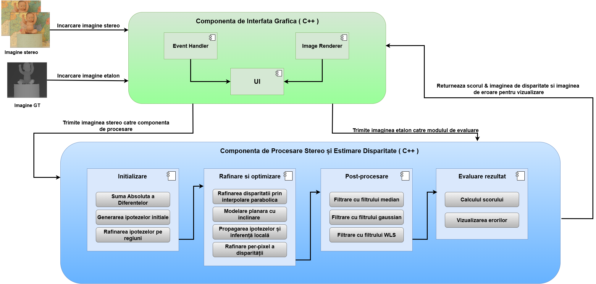

# SOS: Slanted O(1) Stereo Matching

**Slanted O(1) Stereo (SOS)** is a high-speed stereo matching algorithm for real-time depth estimation. Unlike traditional methods that assume fronto-parallel surfaces, SOS estimates **slanted disparity planes** per tile, providing accurate depth reconstruction of non-flat surfaces while maintaining O(1) per-pixel runtime.

---

## 🎥 Demo


*This demo shows the SOS algorithm running on stereo images, generating disparity and depth maps using planar slant estimation.*

---

## 🧰 Architecture Overview



### SOS Pipeline:

1. **Hierarchical Initialization**  
   - Divide the image into 16×16 pixel tiles  
   - Randomly sample disparity hypotheses  
   - Use Sum of Absolute Differences (SAD) for cost evaluation  

2. **Slant Estimation**  
   - Fit a plane model (d, dx, dy) per tile  
   - Use parabola fitting for subpixel refinement  

3. **CRF Propagation**  
   - Apply a simplified Conditional Random Field (CRF) to refine tile consistency and smooth transitions  

4. **Per-pixel Refinement**  
   - For each pixel, select the best disparity using local 11×11 SAD windows based on neighboring plane hypotheses  

5. **Filtering**  
   - Use median filtering to reduce noise and improve output smoothness  

---

## ⚙️ How to Use

### Requirements

- **OpenCV** – for image processing and filtering  
- **wxWidgets** – for GUI elements (file dialogs, visualization)

### Setup

1. Install **OpenCV**:  
   https://opencv.org/releases/

2. Install **wxWidgets**:  
   https://www.wxwidgets.org/downloads/

3. Compile the project using Visual Studio:  
   - Include `sos.cpp`, `gui.cpp`, and `sos.h`  
   - Link against OpenCV and wxWidgets  

---

## 📂 Project Structure

### Main Branch

```
├── README.md                # Project documentation (this file)
├── project_architecture.png # SOS architecture diagram
├── tutorial.mp4             # Demo video of the algorithm
```

### Code Branch

```
├── sos.cpp                  # Main SOS algorithm implementation
├── gui.cpp                  # GUI implementation using wxWidgets
├── sos.h                    # Header file for SOS algorithm structures and functions
```

### Test_Images Branch

```
├── left01.png               # Example left stereo image
├── right01.png              # Example right stereo image
├── ground_truth.png         # Ground truth disparity (optional for evaluation)
```

---

## 📊 Features

- **O(1) Complexity per Pixel**  
   Each pixel is processed in constant time regardless of disparity range or window size.

- **Slanted Support Windows**  
   Accurately models slanted surfaces with per-tile disparity planes.

- **Subpixel Refinement**  
   Uses parabola fitting for subpixel precision in disparity estimation.

- **CRF-based Propagation**  
   Ensures consistent disparity assignment across neighboring tiles.

- **Filtering**  
   Median filtering is applied to smooth the final depth map and reduce outliers.

---

## 📈 Performance

- Runs on CPU with high-speed execution, mean execution time of the algorithm: **1.28s** for 1248x1120 resolution images  
- Capable of processing complex scenes with slanted and non-fronto parallel surfaces  
- Outputs both **disparity maps** and **error maps**
- Has a mean accuracy of **87 %** compared to the GroundTruth image

---

## 📜 License

This project is provided for **academic and educational use only**.  
For commercial use or research collaborations, please contact me: lorand.sarkozi25@yahoo.com
